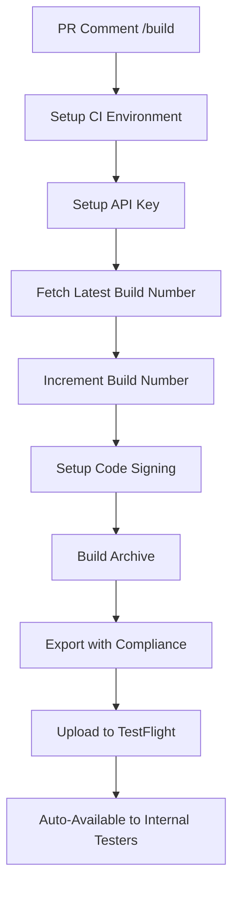

# CD Starter Project

A production-ready iOS calculator app with fully automated CI/CD pipeline for TestFlight deployment.

## iOS CI/CD Pipeline

This project demonstrates a **complete, working iOS CI/CD setup** using GitHub Actions and Fastlane. The pipeline has been battle-tested and includes solutions for common iOS deployment challenges.

### ✅ **Proven Solutions Included**

- **TestFlight Auto Distribution**: Fixed API key permission issues
- **Missing Compliance Resolution**: Automatic export compliance handling
- **Build Number Management**: Race condition protection with buffer system
- **Certificate Management**: Works with Developer role permissions
- **Branch Protection**: Comprehensive conflict resolution

### Build Commands

Comment on any Pull Request to trigger builds:

- **`/build`** - Full App Store build and upload to TestFlight

### Setup Requirements

#### 1. Apple Developer Account
- Active Apple Developer Program membership
- App Store Connect access
- **Developer role is sufficient** (Admin role not required)

#### 2. GitHub Secrets Configuration

Add these secrets to your repository (Settings → Secrets → Actions):

```bash
# Required - App Store Connect API Key
API_KEY_ID          # App Store Connect API Key ID
API_ISSUER_ID       # App Store Connect Issuer ID  
API_KEY_BASE64      # Base64 encoded .p8 file content

# Required - Apple Developer Account  
DEVELOPMENT_TEAM    # Apple Developer Team ID
FASTLANE_USERNAME   # Your Apple ID email

# Optional - For advanced certificate management
MATCH_GIT_URL       # Git repository for certificate storage
MATCH_PASSWORD      # Password for certificate encryption
```

#### 3. App Store Connect API Key Setup

1. Go to [App Store Connect](https://appstoreconnect.apple.com)
2. Navigate to **Users and Access → Keys**
3. Create new API Key with **Developer** role (sufficient for uploads)
4. Download the `.p8` file
5. Base64 encode: `base64 -i AuthKey_XXXXXXXXXX.p8 | pbcopy`
6. Add to GitHub secrets as `API_KEY_BASE64`

> **Note**: Developer role works perfectly for TestFlight uploads. Admin role only needed for automatic external distribution (which we handle manually for better control).

### How It Works

#### 🚀 **Automated TestFlight Distribution**

Our setup uses **Almosafer's proven approach** for reliable TestFlight uploads:

```ruby
# Optimized for Developer API key permissions
testflight(
  username: ENV["FASTLANE_USERNAME"],
  skip_waiting_for_build_processing: true,
  changelog: "Automated build with latest features"
)
```

**Benefits:**
- ✅ **Internal testers** get automatic access
- ✅ **External testers** require manual approval (better control)
- ✅ **No API key permission errors**
- ✅ **Works with Developer role**

#### 🔧 **Build Number Management**

Intelligent build number handling with race condition protection:

```ruby
# Fetch latest + buffer for API delays
latest_build = latest_testflight_build_number()
new_build = latest_build + 2  # Buffer for race conditions
```

#### 📋 **Export Compliance Automation**

Automatic handling of export compliance to prevent "Missing Compliance" issues:

- **Custom Info.plist** with proper export compliance settings
- **`ITSAppUsesNonExemptEncryption = NO`** for non-encryption apps
- **Automatic TestFlight availability** without manual compliance submission

#### 🔐 **Smart Certificate Management**

Handles various certificate scenarios gracefully:

- **Match integration** for team certificate sharing
- **Manual certificate import** fallback
- **Development certificate auto-creation** in CI
- **Graceful permission handling** for different Apple Developer roles

### Architecture

#### Fastlane Lanes

| Lane | Purpose | When to Use |
|------|---------|-------------|
| `build_and_upload` | Complete App Store build → TestFlight | Production deployments |
| `test` | Run unit tests | Local development and testing |

#### Build Process Flow



### Local Development

#### Quick Start
```bash
# Install dependencies
bundle install

# Run tests
bundle exec fastlane test

# Build locally
bundle exec fastlane build_and_upload
```

#### Development Workflow
1. **Clone repository**
2. **Configure secrets** in GitHub
3. **Create Pull Request** to develop or feature branch
4. **Deploy with `/build`** comment on PR

### Security & Best Practices

- ✅ **API keys encrypted** in GitHub secrets
- ✅ **Temporary file cleanup** after builds
- ✅ **No sensitive data logging**
- ✅ **Proper keychain management** in CI
- ✅ **Branch protection** with conflict resolution
- ✅ **Comprehensive `.gitignore`** for iOS projects

### Project Structure

```
.
├── .github/workflows/
│   ├── build-on-comment.yml    # Comment-triggered builds
│   ├── ios-build-and-deploy.yml # Push-triggered builds
│   └── testing_workflow.yaml   # Automated testing
├── fastlane/
│   ├── Fastfile                # Build automation (battle-tested)
│   ├── Appfile                 # App configuration
│   └── template.env            # Environment template
├── CD starter project/         # iOS app source
├── CD-starter-project-Info.plist # Export compliance configuration
├── .gitignore                  # iOS-specific exclusions
└── README.md                   # This documentation
```

## Development

### Requirements
- **Xcode 16.1+**
- **iOS 16.0+** deployment target
- **Swift 5.9+**
- **Ruby 3.2+** for Fastlane

### Building Locally
1. Open `CD starter project.xcodeproj` in Xcode
2. Select your development team
3. Build and run on simulator or device

### Testing
- **Unit tests**: `CD starter projectTests`
- **UI tests**: `CD starter projectUITests`
- **Fastlane tests**: `bundle exec fastlane test`

## Contributing

1. **Create feature branch** from `develop`
2. **Make changes** and add tests
3. **Create Pull Request**
<<<<<<< HEAD
4. **Test with `/diagnostic`** to verify CI
5. **Deploy with `/build`** for TestFlight
6. **Merge** when ready 
=======
4. **Deploy with `/build`** for TestFlight
5. **Merge** when ready
>>>>>>> 9b9b362 (feat: Simplify CI/CD to only support /build command)
